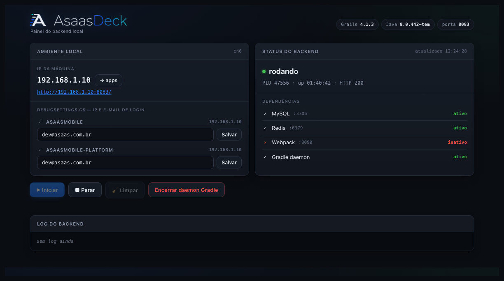

# AsaasDeck

Painel local, no navegador, para gerenciar um backend Grails de desenvolvimento — ver status,
iniciar, parar e limpar, acompanhar o log e manter os apps mobile apontando para o IP certo da
máquina.



Um único arquivo Python, biblioteca padrão apenas: sem `pip install`, sem `node_modules`, sem build
step. O HTML, o CSS e o JavaScript são servidos embutidos no próprio script.

## Por que existe

Rodar um backend Grails grande localmente envolve uma sequência chata e repetitiva: carregar o
SDKMAN, fixar as versões de Java e Grails, entrar na pasta certa, subir a aplicação, descobrir o IP
da máquina, copiar esse IP para a configuração dos apps mobile, e caçar no log o código OTP para
concluir um login de teste. O AsaasDeck junta tudo isso em uma página.

## Requisitos

- macOS
- `python3` (o do sistema serve; se faltar: `brew install python3`)
- SDKMAN instalado em `~/.sdkman`, com as versões de Java e Grails do projeto
- O backend e suas dependências (banco, cache) já configurados para rodar localmente

## Instalação

```bash
git clone https://github.com/PeterNovassatt/asaas-deck.git
cd asaas-deck
./install.sh
```

O instalador copia o script para `~/.local/bin/asaas-deck` e, se necessário, adiciona esse
diretório ao `PATH` no seu `~/.zshrc`.

Em um terminal novo:

```bash
asaas-deck
```

E abra <http://localhost:7070>.

Para atualizar: `git pull && ./install.sh`.

> Sem instalar nada: `python3 asaas-deck` funciona direto da pasta clonada.

## Uso

### Status e dependências

O bloco da direita mostra o estado do backend — **rodando**, **iniciando** ou **parado** — com PID,
tempo de execução e o código HTTP que a aplicação está devolvendo de fato. Abaixo, as dependências
que precisam estar de pé (MySQL, Redis, Webpack) e o daemon do Gradle. Cada item tem ícone, cor e
texto, para não depender só de cor.

### Iniciar, parar e limpar

| Botão | O que faz |
|---|---|
| **Iniciar** | Abre uma janela do terminal e sobe o backend |
| **Parar** | Encerra o processo do backend e libera a porta |
| **Limpar** | Roda `grails clean` (só com o backend parado) |
| **Encerrar daemon Gradle** | Mata daemons órfãos que ficam segurando locks do build |

O **Iniciar** abre uma janela do seu terminal (iTerm2 se você tiver, senão o Terminal do macOS),
espera 5 segundos e executa um script gerado em `~/.asaas-deck/start-backend.sh`. Isso não é
capricho: o `grails run-app` não conclui o startup sem um terminal de verdade — sem TTY ele fica
pendurado indefinidamente no `bootRun`.

Duas consequências boas: o build fica visível na janela, então você acompanha e pode interromper com
Ctrl+C; e o backend não morre se você fechar o painel, porque os processos são independentes.

Na primeira vez o macOS pede autorização para o AsaasDeck controlar o terminal — aceite. Se recusar
por engano, libere em **Ajustes do Sistema > Privacidade e Segurança > Automação**.

### IP e e-mail dos apps mobile

O bloco da esquerda mostra o IP da máquina e, para cada app mobile, o IP e o e-mail de login que
estão hoje no `DebugSettings.cs`:

- **verde** — o IP do arquivo bate com o da máquina
- **amarelo** — divergente; clique em **→ apps** para gravar o IP atual nos dois
- **vermelho** — arquivo não encontrado (repo não clonado ou em outro caminho)

O campo de e-mail grava o `LoginUsername` de cada repositório separadamente, porque em geral são
contas de teste diferentes em cada app. As alterações aparecem no `git diff` do repo correspondente
— o AsaasDeck nunca commita nada.

### Código OTP

Quando o log traz um código de verificação, ele aparece em destaque no topo, com botão para copiar
(o próprio número também é clicável). O reconhecimento é uma heurística: números de 4 a 8 dígitos
perto de palavras como `otp`, `código`, `token` ou `verificação`. Para ajustar ao formato do seu
log, sem editar o script:

```bash
ASAAS_OTP_REGEX='seu padrão com (\d+) no grupo 1' asaas-deck
```

### Log

O log aparece com timestamps discretos e cores por nível — erros e exceções em vermelho, avisos em
âmbar, informação em verde. A barra de progresso do Gradle é filtrada: ela é escrita sem quebra de
linha e cola nas mensagens da aplicação, então o painel remove esses trechos de dentro da linha em
vez de descartar a linha inteira (que levaria embora o log útil, OTP incluído).

### No celular

A interface é responsiva e o painel escuta na rede local, então dá para abrir do celular usando o
IP da máquina: `http://SEU_IP:7070`. Tem favicon e apple-touch-icon, então o atalho na tela de
início fica com o ícone certo.

## Configuração

O AsaasDeck detecta sozinho onde estão os repositórios, procurando em `~/Documents`,
`/Volumes/workspace`, `~/Projects` e no home. Se os seus caminhos forem outros, crie
`~/.asaas-deck/config.json` a partir do `config.example.json` e apague o que não precisar.

Tudo também funciona por variável de ambiente, com o prefixo `ASAAS_`:

```bash
ASAAS_DECK_PORT=7071 asaas-deck        # outra porta para o painel
ASAAS_CORE_DIR=/Volumes/workspace/asaas-core asaas-deck
ASAAS_TERMINAL=Terminal asaas-deck     # força o Terminal do macOS
ASAAS_TERM_DELAY=8 asaas-deck          # mais tempo antes de injetar o comando
```

| Chave | Padrão | Para quê |
|---|---|---|
| `core_dir` | autodetectado | raiz do projeto do backend |
| `asaasmobile_dir` / `asaasmobile_platform_dir` | autodetectado | repos mobile (opcionais) |
| `deck_port` | `7070` | porta do painel |
| `app_port` | `8083` | porta do backend |
| `java` / `grails` | `8.0.442-tem` / `4.1.3` | versões usadas no `sdk use` |
| `term_delay` | `5` | segundos antes de injetar o comando |
| `terminal` | iTerm2 se existir | `iTerm` ou `Terminal` |
| `otp_regex` | heurística | padrão de extração do código OTP |
| `start_cmd` | script gerado | comando alternativo de start |

## Arquivos criados

Tudo fica em `~/.asaas-deck/`:

| Arquivo | Conteúdo |
|---|---|
| `backend.log` | saída do backend (sobrescrito a cada Iniciar) |
| `task.log` | saída da última limpeza |
| `start-backend.sh` | script gerado pelo botão Iniciar |
| `config.json` | suas configurações (opcional) |

## Como funciona por dentro

`ThreadingHTTPServer` da biblioteca padrão servindo uma página estática e uma API mínima:

| Rota | O que faz |
|---|---|
| `GET /api/status` | estado do backend, IP, dependências, apps mobile e OTP |
| `GET /api/logs` | log tratado |
| `POST /api/start` \| `/stop` \| `/clean` \| `/daemon` | ações |
| `POST /api/inject-ip` | grava o IP nos `DebugSettings.cs` |
| `POST /api/set-email` | grava o `LoginUsername` de um app |

O estado das portas vem de uma única chamada de `lsof` com cache de 2 s — quatro chamadas separadas
a cada refresh custavam ~5 s por atualização.

## Desenvolvimento

O HTML/CSS/JS fica na constante `PAGE`, dentro do próprio `asaas-deck`. Para mexer na interface,
edite essa string e reinicie o processo — não há build.

Antes de abrir um PR, rode as mesmas verificações do CI:

```bash
python3 -m py_compile asaas-deck
zsh -n install.sh
python3 .github/scripts/check_page.py
```

O `check_page.py` protege contra dois erros silenciosos: um `"""` no HTML quebrando a string
Python, e a remoção de um elemento que o JavaScript da página procura por id.

## Problemas comuns

**`Address already in use`** — já existe um AsaasDeck rodando; abra <http://localhost:7070>. Se for
outro processo, use `ASAAS_DECK_PORT=7071 asaas-deck`.

**`asaas-deck: command not found`** — `~/.local/bin` não está no `PATH`. Abra um terminal novo ou
rode `source ~/.zshrc`.

**Botão Iniciar não faz nada** — falta autorização de Automação para o terminal (a mensagem no
painel diz isso). Libere em Ajustes do Sistema > Privacidade e Segurança > Automação.

**Dependências em vermelho** — banco e cache não estão de pé. Suba os containers do projeto.

**Status fica em "iniciando" por muito tempo** — normal depois de uma limpeza: um build completo
leva vários minutos. Acompanhe na janela do terminal.

**O log não atualiza** — o backend em execução escreve no arquivo aberto quando ele subiu. Se o
`backend.log` foi substituído no meio do caminho, o log volta a aparecer no próximo Iniciar.

## Licença

MIT — veja [LICENSE](LICENSE).
